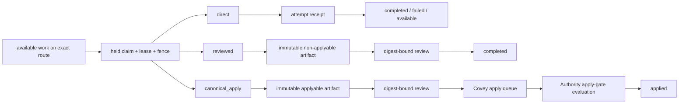

# Covey Architecture

Covey is a small, correctness-critical coordination substrate. The architecture is intentionally boring: one authoritative transactional store, one typed library API, and a thin CLI boundary for local operation.

## Design Rules

- The SQLite schema and transaction checks are the source of truth.
- Domain invariants must be encoded in schema constraints, typed request/response models, or validator functions.
- JSON is a transport format at the boundary, not the internal data model.
- The CLI must stay transport-thin and map directly onto the library API.
- Completion policy and routing are immutable coordination facts, not runtime
  supervision or authority grants.

## Module Map

### Core library

- `src/lib.rs`
  Re-export surface for the crate. This is the public API entrypoint.
- `src/model.rs`
  Typed domain records, request DTOs, status payloads, event payloads, and persisted-state enums.
- `src/error.rs`
  Typed domain errors for invalid transitions, ownership violations, lease failures, and storage issues.
- `src/schema.rs`
  Forward-only migrations, SQLite pragmas, and event-log append helpers.
- `src/queries.rs`
  Read-side row loading and deserialization helpers.
- `src/validators.rs`
  Transaction-scoped invariant checks and transition guards.
- `src/overlap.rs`
  Reservation overlap normalization, lookup, and conflict recording logic.
- `src/store.rs`
  Connection ownership, transaction helpers, idempotency persistence, and shared mutation utilities. This file should not grow back into the full API surface.

### Operation modules

All library mutations and read workflows hang off `Covey`, but the implementation is split by domain under `src/ops/`.

- `ops/session.rs`
  Session register, heartbeat, exit, and status logic.
- `ops/meta_task.rs`
  Meta-task submission, cancellation, and meta-task status.
- `ops/workflow/create.rs`
  Legacy and explicit-policy work creation. Legacy creation is fixed to
  `completion_policy=canonical_apply` and `routing_key=mutai`.
- `ops/workflow/lifecycle.rs`
  Exact-route claim selection plus the held-claim, lease, fence, start,
  release, and abandon lifecycle.
- `ops/workflow/completion.rs`
  Fenced direct-work success, retryable-failure, and terminal-failure receipts.
- `ops/workflow/artifact_review.rs`
  Policy-gated artifact publication and exact-digest review lifecycle.
- `ops/workflow/status.rs`
  Policy/routing-aware status, candidate, availability, stuck-work, and
  expiring-claim projections.
- `ops/queue.rs`
  Ready-queue enqueue, claim, apply, supersede, and metrics logic.
- `ops/reservation.rs`
  Reservation lifecycle, overlap lookup, event listing, and conflict resolution.
- `ops/maintenance.rs`
  Lease-based cleanup and stale-session/claim/reservation maintenance.
- `ops/import/openspec.rs`
  OpenSpec-to-Covey import. Better Droid changes are imported from compiled mission JSON artifacts
  and import-owned provenance only; this module must not claim work, schedule workers, enqueue apply
  work, mutate OpenSpec source, or become a settlement authority.

### CLI boundary

- `src/bin/covey.rs`
  Process startup plus clap command and argument definitions.
- `src/bin/dispatch_support.rs`
  CLI-to-library dispatch. This translates parsed clap args into typed `Covey` requests and typed success acks.
- `src/bin/render_support.rs`
  Output-mode selection, human/json rendering, structured error reporting, and typed CLI envelope payloads.

## Dependency Direction

The intended dependency flow is:

`bin/* -> lib re-exports -> ops/* -> validators/queries/schema/store -> SQLite`

Important constraints:

- `render_support.rs` must not acquire domain logic.
- `dispatch_support.rs` must not manually encode ad hoc JSON payloads for typed operations.
- `ops/*` may share helpers through `store.rs`, but business logic should stay in the domain module that owns it.
- `model.rs` and `error.rs` define the language of the system. Other modules should depend on those types rather than invent parallel wire shapes.

## Execution And Settlement Split

Covey has three task completion policies, but only one enters repository
settlement:



Legacy canonical findings and verification artifacts retain their existing
review-to-`applied` compatibility path without entering the apply queue. This
is an explicit compatibility case, not the `direct` policy and not Authority
settlement evidence.

`subtask_attempt_outcomes` is authoritative only for Covey's direct attempt
history. Its evidence digest and summary do not attest that a model was correct,
that a repository changed, or that Authority approved settlement. The
`canonical_apply` branch retains the existing artifact, review, queue, apply
gate, and Authority trust boundary.

Routing has similarly narrow meaning. `routing_key` is an exact eligibility
partition used by candidate, availability, and claim-next operations. It does
not authenticate a worker, supervise an agent, allocate process capacity, or
grant permission to perform side effects. Legacy APIs are pinned to `mutai` so
generic routes cannot leak into the existing scheduler view.

The routed claim-next contract applies to executor work. Generated review
subtasks remain on the shared `mutai` reviewer lane and use `canonical_apply`
as the structural policy value required for non-work rows; that value grants no
settlement authority. Consumer-specific reviewer pools and inherited review
routing are deferred product decisions.

Covey contains no Hermes adapter. A later adapter may register its own sessions
and use an explicit route, but it must own polling, process supervision,
heartbeats, and transport outside this crate. It must not duplicate Covey task,
claim, lease, fence, or attempt-outcome state.

## What To Avoid

- Reintroducing a monolithic `store.rs` that mixes connection plumbing with every operation.
- Adding workflow logic directly to the CLI layer.
- Using `serde_json::Value` as a substitute for request/response structs in production paths.
- Hiding state-machine rules in comments instead of validators or type shapes.
- Treating `completed` as reviewed, landed, or settled without the policy-bound
  evidence required for those meanings.
- Adding route-specific background workers, polling loops, agent supervision,
  or a second retry scheduler to Covey.

## Verification Expectations

Architectural changes in Covey should usually prove all of the following before being considered done:

```bash
cargo fmt --check
cargo clippy --all-targets --all-features -- -D warnings
cargo test
```
